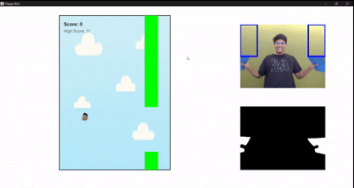
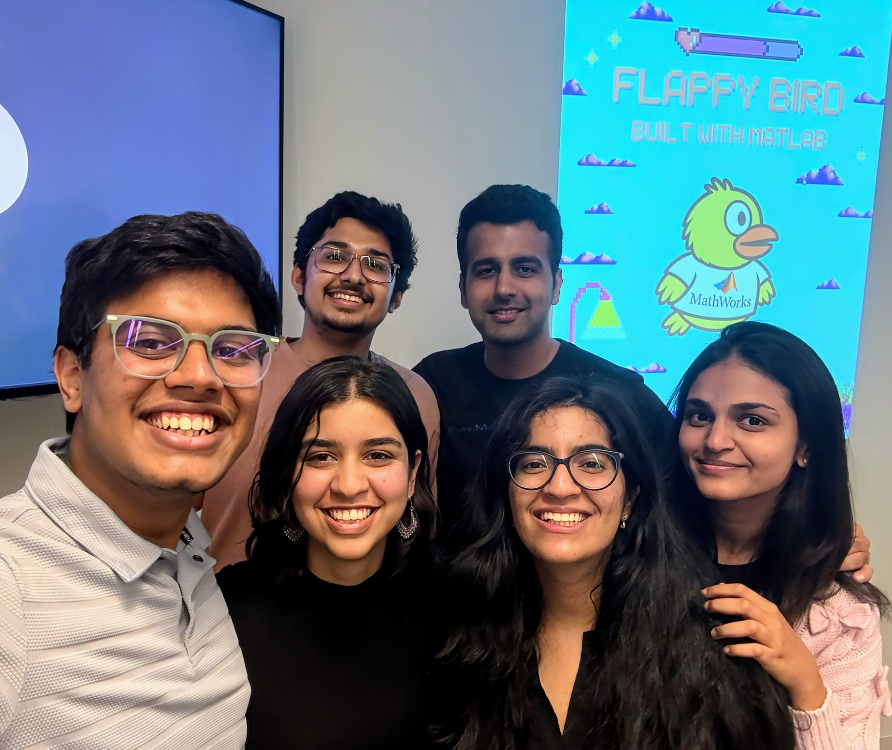

## 🐤 Vision-Controlled Flappy Bird (MATLAB)

This is a **MATLAB-based implementation** of the classic *Flappy Bird* game — controlled entirely by **computer vision**. Instead of pressing buttons, players use **colored objects (your "wings")** and perform **flapping motions** to control the bird. This hands-free interaction brings a fun, physical twist to the nostalgic game!


## 🎮 How to Play

1. **Clone the Repository**
   ```bash
   git clone https://github.com/garrysawyers3007/Vision_Bird.git
   ```
2. **Install MATLAB**  
   If you haven't already, [download and install MATLAB](https://www.mathworks.com/help/install/ug/install-products-with-internet-connection.html).  Make sure to include the following toolboxes:
   - *Image Acquisition Toolbox*
   - *Computer Vision Toolbox*

3. **Set Up Your Webcam**  
   The game uses your default webcam by default. To use a different camera, run `webcamlist` in the MATLAB command window and copy the desired camera name. Update this line in `calibrate_color.m`:
     ```
     cam = webcam("Your Camera Name");
     ```

4. **Launch the Game**  
   In MATLAB, navigate to the cloned folder and run:
   ```
   flappy_bird_main
   ```

5. **Choose Your Bird**  
   You'll be prompted to either:
   - Use the default bird sprite, or  
   - Use your **own face** as the bird!  
   If using your face, draw a bounding box around it when prompted.

6. **Calibrate Your Wings**  
   - Hold two colored objects of the same color in your hands (your "wings").
   - Use the calibration window to draw a bounding box within one wing to detect its color.
   - Make sure the color **contrasts well with the background** for accurate detection.

7. **Start Flapping!**  
   After a 3–2–1 countdown:
   - Flap your "wings" (move the colored objects up and down).
   - Ensure they **exit the red detection boxes** to register a flap.
   - Each flap gives the bird a vertical velocy to fly higher.

8. **Avoid Obstacles**  
   Just like in the original game:
   - If you stop flapping, the bird falls due to gravity.
   - Dodge the pipes and try to survive as long as possible!


## 🔧 Implementation Details

### User Interface (UI)  
The game window includes:  
- A live webcam feed showing the player's movements.  
- A mask preview displaying the detected colored wings, helping users track their wings during gameplay.  
- A main gameplay area displaying the bird, pipes, and score.  
- After the game ends, the interface shows **“Game Over”** along with **Restart** and **Exit** buttons.  
- The layout is built using MATLAB’s UI components such as axes, rectangles, and text.

### Computer Vision  
- The program captures video frames using MATLAB’s webcam interface, with the feed mirrored for natural interaction.  
- The player selects a color to represent their "wings" during a calibration step.  
- Frames are converted to HSV color space for robust color detection under varying lighting conditions.  
- Binary masks isolate regions matching the selected wing color.  
- Detection zones are defined on each side of the camera feed. The algorithm uses bitwise operations to determine how much of the wing is within these zones.  
- A **flap** is triggered when:  
  1. Wings were simultaneously inside the detection zones in the previous frame, and  
  2. They are no longer in the detection zones in the current frame.

## 🎥 Demo and Credits
Here's a flapping demo. Note how the bird hops everytime his wings flap **out** of the detection zones:


If you want a rundown of how to run the game and go through the callibration phase, check it out here: [Demo](https://drive.google.com/file/d/1Mr8nJcGTsq-wVExSaDvRlMApsTDyj2di/view?usp=drivesdk)

Meet the team:





<!---->
[Niranjan Sundararajan](https://www.linkedin.com/in/sundararajann) - Flappiest Bird; [Seher Bhaskar](https://www.linkedin.com/in/seher-bhaskar) - Documentation Duchess; [Akanksha Tanwar](https://www.linkedin.com/in/akankshatanwar17) - Project Manager (self-declared); [Hamsitha Challagundla](https://www.linkedin.com/in/hamsithachallagundla) - Marketing Magician; 
[Vaibhav Mahapatra](https://www.linkedin.com/in/vaibhav-mahapatra-aa0a591a8) - Komedy King;  [Gauransh Sawhney](https://www.linkedin.com/in/gauransh3007) - Consolidation King; 
